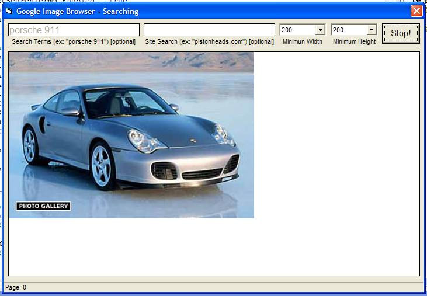



## Google Image Grabber

### Description

This program will grab the first 1000 images from Google for any search. This will help you locate porn, get pictures of your favorite car, or possibly even something usefull. Saves download picutures to a folder called "pics". Let me know what bugs this has so I can fix them and re-upload it (I probably should have spent this last hour sleeping instead of coding, so it isn't exactly da vinci) =P Enjoy!
 
### More Info
 
You may end up with a lot of porn and car pictures on your hard drive, so be careful!

             |
---                |---
**Submitted On**   |2004-04-14 04:21:24
**By**             |[marc\.newlin](https://github.com/Planet-Source-Code/PSCIndex/blob/master/ByAuthor/marc-newlin.md)
**Level**          |Beginner
**User Rating**    |4.2 (42 globes from 10 users)
**Compatibility**  |VB 6\.0
**Category**       |[Internet/ HTML](https://github.com/Planet-Source-Code/PSCIndex/blob/master/ByCategory/internet-html__1-34.md)
**World**          |[Visual Basic](https://github.com/Planet-Source-Code/PSCIndex/blob/master/ByWorld/visual-basic.md)
**Archive File**   |[Google\_Ima1733244142004\.zip](https://github.com/Planet-Source-Code/marc-newlin-google-image-grabber__1-53144/archive/master.zip)

